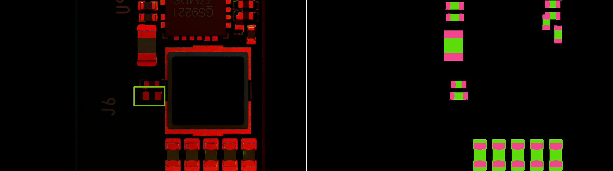
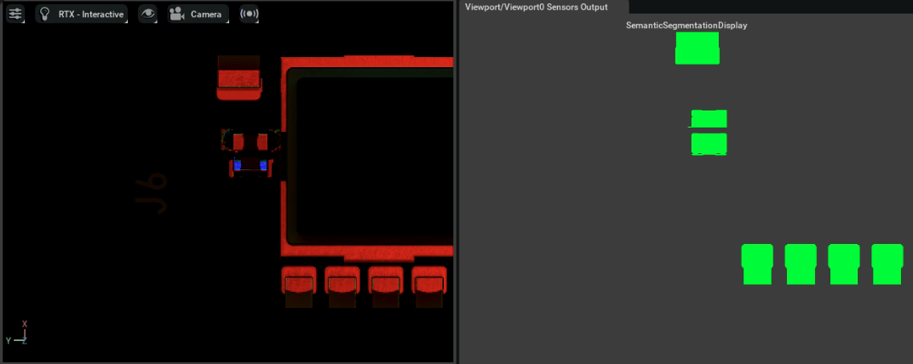
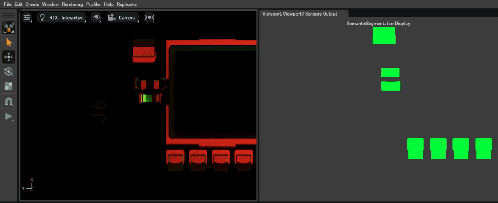
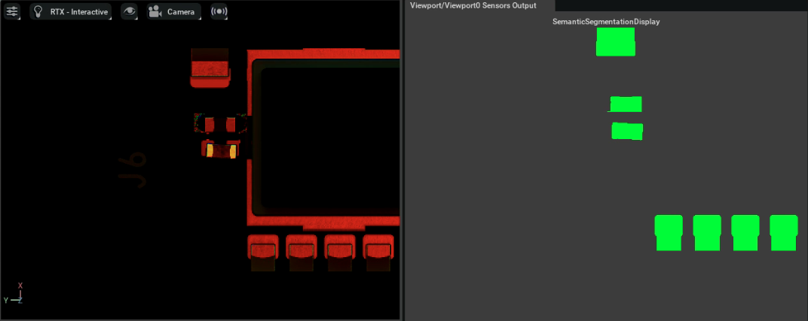

# Scripts — PCB AOI Synthetic Data Generation

Scripts for generating synthetic data of PCB AOI (Automated Optical Inspection) in Isaac Sim.

## Directory Structure

```
scripts/
├── sdg/
│   ├── editor/          # Paste-and-run scripts for Isaac Sim Script Editor
│   │   ├── capture_current_view.py
│   │   ├── sdg_good_image_pipeline.py
│   │   └── pose_ops/
│   │       ├── missing.py
│   │       ├── run_shift.py
│   │       ├── run_sideflip.py
│   │       └── run_tombstone.py
│   └── standalone/      # Standalone scripts for Kit App execution
│       ├── sdg_good_image_pipeline.py
│       ├── sdg_defect_image_pipeline.py
│       └── pose_ops/
│           ├── utils.py
│           ├── shift.py
│           ├── sideflip.py
│           └── tombstone.py
├── generators/
│   └── gen_ring_light.py
└── config/
    ├── good_image.yaml
    └── defect_image.yaml
```

## Usage

### Editor Scripts (`sdg/editor/`)

Paste-and-run scripts for the **Isaac Sim Script Editor**:

1. Open Isaac Sim and load your PCB USD scene
2. Open the Script Editor: `Window → Script Editor`
3. Paste the script content into the Script Editor
4. Modify the **Config** section at the top of each script:
   - `COMPONENT_PATH` / `TARGET_PRIM`: Replace with the USD prim path of the component you want to operate on
   - `OUTPUT_DIR` / `OUTPUT_ROOT`: Replace with your desired output directory path
   - Camera / lighting prim paths: Adjust to match your scene hierarchy
5. Click `Run` to execute

### Standalone Pipeline Scripts (`sdg/standalone/`)

Standalone scripts that run headlessly via the Kit App built from the [omni.replicator](https://gitlab-master.nvidia.com/omniverse/synthetic-data/omni.replicator/-/tree/release/kit-110.1) repo. All parameters are driven by YAML config files (see `config/`).

**Prerequisites**: Build the Kit App from the `release/kit-110.1` branch of `omni.replicator`:

```bash
cd ~/Downloads/omni.replicator
./build.sh        # or premake / repo_build as per the repo instructions
```

**Running**:

```bash
cd ~/Downloads/omni.replicator/_build/linux-x86_64/release

# Good image pipeline
./omni_replicator.sh --no-window --exec \
    "/path/to/scripts/sdg/standalone/sdg_good_image_pipeline.py \
     --config /path/to/config/good_image.yaml"

# Defect image pipeline
./omni_replicator.sh --no-window --exec \
    "/path/to/scripts/sdg/standalone/sdg_defect_image_pipeline.py \
     --config /path/to/config/defect_image.yaml"
```

#### Standalone Pose Ops (importable modules)

Modular functions for pipeline integration:

```python
from standalone.pose_ops.shift import apply_shift
from standalone.pose_ops.tombstone import apply_tombstone
from standalone.pose_ops.sideflip import apply_sideflip

apply_shift("/World/.../component_path", translate_range=0.2, rotate_z_range=15)
apply_tombstone("/World/.../component_path", angle_min=30, angle_max=90)
apply_sideflip("/World/.../component_path", angle_min=0, angle_max=30)
```

Shared utilities (`utils.py`):
- `get_prim_and_original_transform()` — Retrieve prim and read its original transform matrix
- `apply_semantic_label()` — Apply semantic label with TagCache cleanup
- `uniform_sample_scalar()` / `uniform_sample_vec3()` — Random sampling helpers

## Script Descriptions

### `sdg/editor/capture_current_view.py`
Captures a single frame at the current camera position. Outputs RGB, BBox, and Semantic Segmentation annotations.

### `sdg/editor/sdg_good_image_pipeline.py` — Good Image Pipeline

Multi-trigger scan pipeline for generating **good (non-defect) reference images** with domain randomization. Each trigger:

1. Randomizes 3-layer ring light parameters (Inner Red / Middle Green / Outer Blue) — intensity, color, exposure, cone angle, and softness
2. Applies small random camera rotation (±5° X/Y) to simulate PCB tilt
3. Optionally applies augmentation (MotionBlur with configurable probability)
4. Scans the entire PCB using a camera grid (orthographic projection), stepping through all X/Y positions
5. Outputs per-trigger RGB + instance segmentation to separate folders with `metadata.json`

Configurable settings: `NUM_TRIGGERS`, scan grid bounds (`X_START`/`X_END`/`Y_START`/`Y_END`/`STEP`), PathTracing SPP, lighting ranges, augmentation probability.

### `sdg/standalone/sdg_good_image_pipeline.py` — Good Image Pipeline (Standalone)

Standalone version of the good image pipeline. Runs headlessly via Kit App with YAML config (`config/good_image.yaml`). Same pipeline logic as the editor version:

1. Opens USD scene, configures PathTracing
2. Per trigger: randomizes 3-layer ring light, camera rotation, optional MotionBlur augmentation
3. Scans PCB via orthographic camera grid
4. Outputs per-trigger RGB + annotations + `metadata.json`

### `sdg/standalone/sdg_defect_image_pipeline.py` — Defect Image Pipeline (Standalone)

Standalone pipeline for generating **defect images** with randomized component defects. Runs headlessly via Kit App with YAML config (`config/defect_image.yaml`). Each trigger:

1. Discovers components from the PCBA hierarchy based on configured `component_types`
2. Randomly selects components and applies defects (shift / tombstone / sideflip) based on configured ratios
3. Randomizes lighting and camera rotation
4. Scans PCB via orthographic camera grid, **re-applying defects before each `step_async`** to counteract Fabric→USD re-sync
5. Outputs per-trigger RGB + annotations + `metadata.json` (including defect records)

> **Re-apply strategy**: `pose_ops` writes transforms to the Fabric layer, which may be overwritten by USD→Fabric re-sync on each `step_async`. The pipeline stores the random parameters generated on first apply and re-applies `pose_ops` before every render step.

### Defect Simulation Scripts (`pose_ops`)

Uses the Replicator `pose_ops` API to manipulate component transforms at the Fabric layer, simulating various AOI defects. All defect scripts automatically apply **semantic labels** (e.g. `defect=tombstone`) for annotation.

> **Note**: Transform operations exist only in the Fabric layer and do not modify USD attributes.

| Defect Type | Editor Script | Standalone Function | Description |
|------------|---------------|-------------------|-------------|
| Missing Component | `editor/pose_ops/missing.py` | — | Two-pass workflow: Pass 1 captures reference image, Pass 2 hides component and captures defect image |
| Tombstone | `editor/pose_ops/run_tombstone.py` | `standalone/pose_ops/tombstone.py` | One end lifts up, rotating around the bottom edge Y axis (default 0°–30°) |
| Side-flip | `editor/pose_ops/run_sideflip.py` | `standalone/pose_ops/sideflip.py` | Component flips sideways, rotating around the bottom edge X axis (default 0°–30°) |
| Shift | `editor/pose_ops/run_shift.py` | `standalone/pose_ops/shift.py` | Small XY translation (±0.2 mm) + Z-axis rotation (±15°) |

#### Semantic Labeling

Defect scripts automatically write semantic labels via `rep_modify.semantics`, e.g.:
- `defect=shift`, `defect=tombstone`, `defect=sideflip`

Since writing semantic labels to the USD layer triggers a Fabric sync, the scripts use the following workaround:
1. Write the semantic label **before** `pose_ops` (skip if already applied)
2. Clear `TagCache` after writing, so `pose_ops` can recreate Fabric tags

## Sample Output

| Defect Type | Sample |
|-------------|--------|
| Missing Component |  |
| Tombstone |  |
| Side-flip |  |
| Shift |  |

## Generator Scripts

### `generators/gen_ring_light.py` — Ring Light Generator

Standalone Python script (not an Isaac Sim editor script) that generates an `aoi_ring_light.usda` asset. The ring light simulates a multi-color funnel-shaped AOI illumination system with 3 color layers:

| Layer | Color | Radii | LED Count | Description |
|-------|-------|-------|-----------|-------------|
| Inner_Red | Red | r=10, 16 | 22 + 35 | Near-vertical illumination, cone=120° |
| Middle_Green | Green | r=22–43 | 49–95 | Mid-angle illumination, cone=120° |
| Outer_Blue | Blue | r=46–58 | 101–128 | High-angle illumination, cone=120°/180° |

Each LED is a `DiskLight` with natural aim angle (`atan2(r, z)`) plus a per-ring tilt offset. LEDs are arranged on a concave bowl geometry (sphere center=(0,0,-16), R=71). The script includes mathematical verification of beam directions.

Run: `python generators/gen_ring_light.py` (edit `OUT` path before running).

## Test Scene

A temporary scene with lighting, PCBA, and camera pre-configured is available for testing these scripts:

```
omniverse://10.63.172.135/Projects/PEGATRON_AOI/dgx-spark-P4242-A04/temp_scene.usd
```

Open this scene in Isaac Sim before running the scripts.

## Known Issues

### Semantic labeling conflicts with Fabric-layer defect transforms

The `pose_ops` defect scripts (tombstone, sideflip, shift) operate at the **Fabric layer**, while semantic labels (e.g., `semanticLabel` added via Replicator or USD API) are stored in the **USD layer**. This creates a layer conflict:

- When Replicator writes transform changes to Fabric, it bypasses the USD stage entirely.
- However, the annotation/rendering pipeline reads semantic data from the USD stage.
- If you apply a defect transform via `pose_ops` and then attempt to add or modify semantic labels, the USD-layer write can trigger a sync that **overwrites the Fabric-layer transform**, effectively resetting the component back to its original pose.
- Conversely, semantic labels written to the USD layer may not correctly reflect the Fabric-layer pose, causing **mismatched bounding boxes and segmentation masks**.

**Workaround**: All defect scripts have a built-in fix — write the semantic label before `pose_ops` and clear `TagCache` to avoid conflicts. See the [Semantic Labeling](#semantic-labeling) section above.

## Prerequisites

- **Editor scripts**: Isaac Sim with `omni.replicator.core >= 1.13.3`
- **Standalone scripts**: Kit App built from [omni.replicator](https://gitlab-master.nvidia.com/omniverse/synthetic-data/omni.replicator/-/tree/release/kit-110.1) (`release/kit-110.1` branch)
- Scene must contain a valid camera prim and PCB component hierarchy
- Python packages: `numpy`, `pyyaml` (for standalone scripts)
